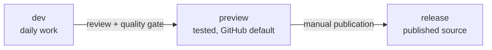
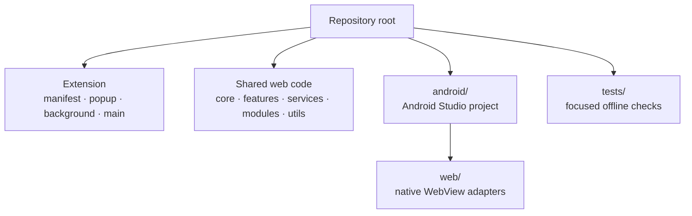

# Contributing to BetterDungeon

Thanks for helping improve BetterDungeon. A useful contribution can be a compatibility fix, a small polish change, clearer documentation, or an Ultrascripts example. AI Dungeon changes frequently, so explain the behavior you observed and test the affected surface in a real adventure.

| Quick link | Purpose |
| --- | --- |
| [Project overview](README.md) | Features, installation, and local builds |
| [Monorepo guide](docs/MONOREPO.md) | Android asset composition and branch policy |
| [AI service](docs/AI.md) | Provider configuration and routing |
| [Navigator Routines](docs/NAVIGATOR_ROUTINES.md) | Scheduling, examples, and safety behavior |
| [Ultrascripts examples](examples/README.md) | Starter scripts and module usage |

## Choose the right branch



Start normal changes from `dev`. A focused topic branch and pull request are welcome; maintainers may also work directly on `dev`. The manual **Promote preview** workflow checks an exact `dev` commit, runs the quality gate, and fast-forwards the protected `preview` branch. Store packages, version tags, and signed Android releases are published separately. Please do not target `release` for ordinary development.

## Get a working checkout

| Task | What you need |
| --- | --- |
| Browser extension | Git, a Chromium browser, and an AI Dungeon account for manual testing |
| Repository checks | Node.js 24 and PowerShell; no npm install is needed |
| Firefox compatibility | Firefox 109 or newer |
| Android app | Android Studio, JDK 21, Android SDK, and an Android 8.1+ device or emulator |

### Browser

1. Clone the repository and switch to `dev` (or create your topic branch from it).
2. In Chromium, open `chrome://extensions/`, enable **Developer mode**, and choose **Load unpacked** on the repository root. In Firefox, use `about:debugging#/runtime/this-firefox` → **Load Temporary Add-on** → `manifest.json`.
3. Open a test adventure at [AI Dungeon](https://play.aidungeon.com/). After code changes, reload the extension in the browser's extension page and refresh the adventure.
4. Check both the popup and the in-adventure UI when your change touches both contexts.

### Android

Open `android/` as the project in Android Studio. Gradle composes shared web assets automatically for Sync, Run, and Debug. You can build the standard debug APK with `./build.ps1 android` from the repository root. See [Android setup](android/README.md) for details. Keep signing keys, `local.properties`, generated files, and store-ready packages out of Git.

## Find the code



| Area | Start with |
| --- | --- |
| Feature startup and lifecycle | `main.js`, `core/feature-manager.js`, `features/` |
| Popup controls | `popup.html`, `popup.js`, `popup.css` |
| AI Dungeon data and integration | `services/` |
| AI providers and Navigator | `services/ai/`, `services/navigator/` |
| Ultrascripts transport and modules | `services/ultrascripts/`, `modules/` |
| Browser package and Android assets | `build/extension-files.txt`, `android/betterdungeon-runtime.json` |

Keep shared JavaScript, CSS, fonts, and popup code at the root. Android-specific behavior should use `BetterDungeonPlatform` capabilities in shared files; reserve `android/web/` for adapters with no browser equivalent. If you add a shared runtime file, check its load order in the extension manifest and Android composition manifest. Avoid a copied Android version of a root implementation.

Features commonly expose `init()` and `destroy()` through the feature manager. Remove listeners, observers, timers, and injected UI during teardown so toggling a feature or navigating an adventure does not leave stale behavior behind. Reuse existing services for storage, AI routing, and AI Dungeon data instead of adding another parallel path.

## Make and verify a change

1. Check for an existing issue or describe the problem you are solving. Keep unrelated cleanup out of the same change.
2. Implement in the smallest shared layer that owns the behavior. Update the popup, manifest, Android composition, examples, or guides when the public behavior changes.
3. Run the focused checks and build artifacts relevant to the change:

   ```powershell
   .\build.ps1 test
   .\build.ps1 extension
   .\build.ps1 android
   # Or run .\build.ps1 all for all three steps.
   ```

4. Test the changed behavior in a live AI Dungeon adventure on the affected browser or Android device. Try it enabled, disabled, after navigation, and after an extension reload where relevant.
5. Describe the outcome in a pull request or issue, including what you tested and any remaining limitation.

The Node checks deliberately cover stable repository boundaries and selected AI and Routine behavior. CI also packages the extension and builds a debug APK on every push and pull request, retaining artifacts for 14 days. It does not call live AI providers or AI Dungeon. UI behavior still needs a real browser or device check; the project does not maintain a comprehensive Playwright suite.

### Ultrascripts changes

Keep module permissions narrow. Validate script input, bound external requests and AI calls, and never include provider keys in messages, story text, errors, or logs. Scripts should receive a clear failure when BetterDungeon, permission, or a platform capability is unavailable. Preserve the existing `bd.us` helper contract unless the change intentionally updates that public interface. The [starter examples](examples/README.md) show both graceful fallback and BetterDungeon-required scripts.

### Review checklist

- [ ] The extension loads without relevant console errors; the affected UI works in an adventure.
- [ ] Feature teardown, reload, and platform differences were checked where relevant.
- [ ] Popup settings still save correctly if controls or storage changed.
- [ ] Firefox and Android were checked if browser APIs or shared platform behavior changed.
- [ ] No credentials, personal adventure content, signing material, or generated packages were committed.
- [ ] Documentation and examples reflect any changed behavior or public interface.

For a bug report, include BetterDungeon and browser versions, the affected AI Dungeon page, steps to reproduce, expected and actual behavior, and sanitized console output or screenshots. For a feature request, explain the player or creator problem first.

## Contribution and license terms

BetterDungeon uses the custom [BetterDungeon License](LICENSE); it is source-available rather than open source. Public source forks, patches, and pull requests are permitted to contribute to the official project. Mark forks as unofficial and keep attribution and license notices. This permission does not cover independent releases, shared installable builds, or selling access; obtain computerK's written consent for those uses. Keep test builds private and do not expose fork CI artifacts containing installable packages.

You own your contribution. By submitting it for inclusion, you grant computerK the rights in Section 3 of the license to use and distribute it in official or authorized BetterDungeon versions. Submit only material you have authority to contribute and identify any third-party material and its license. Files in `examples/` use the MIT terms in Section 8. The [full license](LICENSE) controls if this summary differs; for permission requests, contact `@computerK` on Discord.
