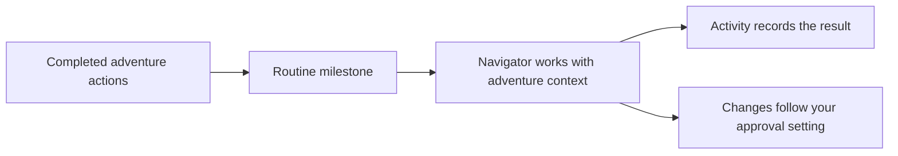

<p align="center"></p>

<h1 align="center">BetterDungeon</h1>

<p align="center"><strong>Make more of every AI Dungeon adventure.</strong></p>

<p align="center">BetterDungeon brings better input controls, world-building tools, an adventure-aware assistant, and new possibilities for AI Dungeon scripts to the game you already play.</p>

<p align="center"><a href="https://chromewebstore.google.com/detail/betterdungeon/ppliljfopejamemejnnchehpbacpebjf">Chrome Web Store</a> · <a href="https://addons.mozilla.org/firefox/addon/betterdungeon/">Firefox Add-ons</a> · <a href="https://github.com/ComputerKWasTaken/BetterDungeon/releases">Android downloads</a></p>

<p align="center"><a href="manifest.json"></a> <a href="https://github.com/ComputerKWasTaken/BetterDungeon/actions/workflows/quality-gate.yml"></a> <a href="LICENSE"></a></p>

[Get BetterDungeon](#get-betterdungeon) · [Start playing](#start-playing) · [Explore the toolkit](#explore-the-toolkit) · [Work from this repository](#work-from-this-repository)

## Get BetterDungeon

| Platform | Download |
| --- | --- |
| Chrome, Edge, and compatible Chromium browsers | [Chrome Web Store](https://chromewebstore.google.com/detail/betterdungeon/ppliljfopejamemejnnchehpbacpebjf) |
| Firefox 109+ | [Firefox Add-ons](https://addons.mozilla.org/firefox/addon/betterdungeon/) |
| Android | Signed APKs, when published, from [GitHub Releases](https://github.com/ComputerKWasTaken/BetterDungeon/releases) |

> [!NOTE]
> Store versions may lag behind the source while v2.1 is submitted and reviewed. The default `preview` branch holds the newest tested source; `release` tracks published source. [How releases work](docs/MONOREPO.md#branches-and-releases)

## Start playing

1. Install BetterDungeon for your platform and open an [AI Dungeon adventure](https://play.aidungeon.com/).
2. Open the BetterDungeon popup to switch on and configure the features you want.
3. For Navigator, Character Prefill, or Ultrascripts AI, add your own provider key in **AI Connections**. Gemini is the simple setup; OpenRouter, Mistral, and custom endpoints are available in Advanced. [AI setup guide](docs/AI.md)

You can use BetterDungeon's non-AI features without configuring an AI provider. Most features have their own switch, so you can keep the experience as light or as involved as you like.

## Explore the toolkit

| What you want to do | Tools to try |
| --- | --- |
| **Play with more control** | Command and Try modes, input history, mode colors, and customizable desktop hotkeys. |
| **Keep a growing world organized** | Per-adventure Notes, Plot and Character Presets, Story Card scanning and analytics, trigger highlighting, and a docked editor. |
| **Get help with the adventure** | Navigator's context-aware chat, research, and reviewable edits. |
| **Put recurring work on autopilot** | Navigator Routines, Custom Dynamic model pools, and optional automatic See requests. |
| **Extend AI Dungeon scripts** | Permission-controlled Ultrascripts modules for widgets, AI, audio, public web reads, time, weather, and more. |

Some controls differ between desktop browsers and Android. The [input-menu guide](docs/INPUT-MENU.md) covers the current desktop and compact layouts; [Ultrascripts examples](examples/README.md) are a starting point for script authors.

### New in v2.1: Navigator and Routines

Navigator is an assistant grounded in your adventure. Ask it questions, have it look through Story Cards, or request changes to adventure content. Its change setting lets you choose automatic verified edits, proposals to review, or conversation without edits.

Routines take that help into the background. Write an instruction, choose how many completed actions should pass between runs, and Navigator handles it while you play. Each Routine keeps a separate conversation; the Activity view shows its work and any changes needing attention. You can also ask Navigator in Chat to run a saved Routine immediately.



Six editable examples start disabled, including NPC Brains, Automatic Story Cards, Story Arcs, and State Management. They are prompts, not rigid script engines: you decide which to enable, and Navigator decides whether the current story calls for a change. [Read the Routines guide](docs/NAVIGATOR_ROUTINES.md).

Version 2.1 also brings shared AI configuration, input-control refinements, and Ultrascripts reliability, audio, and web-request improvements. BetterDungeon's former Markdown and text-to-speech features have been removed; AI Dungeon now handles Markdown natively. The popup's **What's New** section has the fuller release notes.

## Work from this repository

The browser extension and Android app share one source tree. The repository root loads directly as an unpacked browser extension; `android/` is a complete Android Studio project. Shared web code stays at the root, while Android keeps only its native app and unique WebView adapters.

```text
BetterDungeon/
├── manifest.json, popup.*       Browser extension entry points
├── core/, features/, services/  Shared behavior and integrations
├── modules/, utils/             Shared modules and utilities
├── android/                     Android Studio project
│   ├── app/                     Native Android application
│   └── web/                     Unique WebView adapters
├── tests/                       Focused offline checks
└── build.ps1                    Local build interface
```

Use PowerShell from the repository root:

```powershell
.\build.ps1 test       # Focused offline checks
.\build.ps1 extension  # Extension ZIP in dist/
.\build.ps1 android    # Debug APK in dist/
.\build.ps1 all        # Checks and both artifacts
```

The checks use Node.js 24. Android builds also require JDK 21 and the Android SDK; open `android/` in Android Studio to sync, run, or debug. CI runs the same basic checks and builds on pushes, but product behavior still needs hands-on testing in AI Dungeon. [Contributing guide](CONTRIBUTING.md)

Daily development happens on `dev`. Tested commits move to `preview`, then published source moves to `release`; store submission and signed releases are manual. See the [monorepo and delivery guide](docs/MONOREPO.md) for composition and branch details.

## More information

| Guide | Use it for |
| --- | --- |
| [AI Connections](docs/AI.md) | Gemini setup, Advanced providers, and per-feature routing |
| [Navigator Routines](docs/NAVIGATOR_ROUTINES.md) | Scheduling, examples, activity, and approval behavior |
| [Ultrascripts examples](examples/README.md) | Script templates and module usage |
| [Contributing](CONTRIBUTING.md) | Development setup, testing, and contribution rules |
| [Privacy policy](PRIVACY.md) | Local storage and optional third-party requests |

Have a bug or an idea? [Open an issue](https://github.com/ComputerKWasTaken/BetterDungeon/issues), or reach computerK on Discord at `@computerK`. You can [support development on Ko-fi](https://ko-fi.com/computerk).

BetterDungeon is **source-available, not open source**. You may use and privately modify it; public source forks are allowed for contributions to the official project. Independent releases and redistributed builds require permission. Files in `examples/` have the MIT terms described in the [full license](LICENSE).
